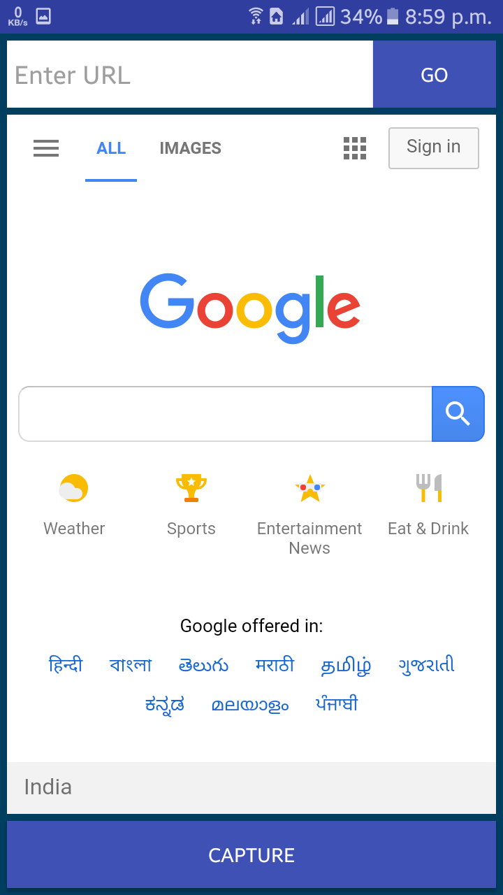
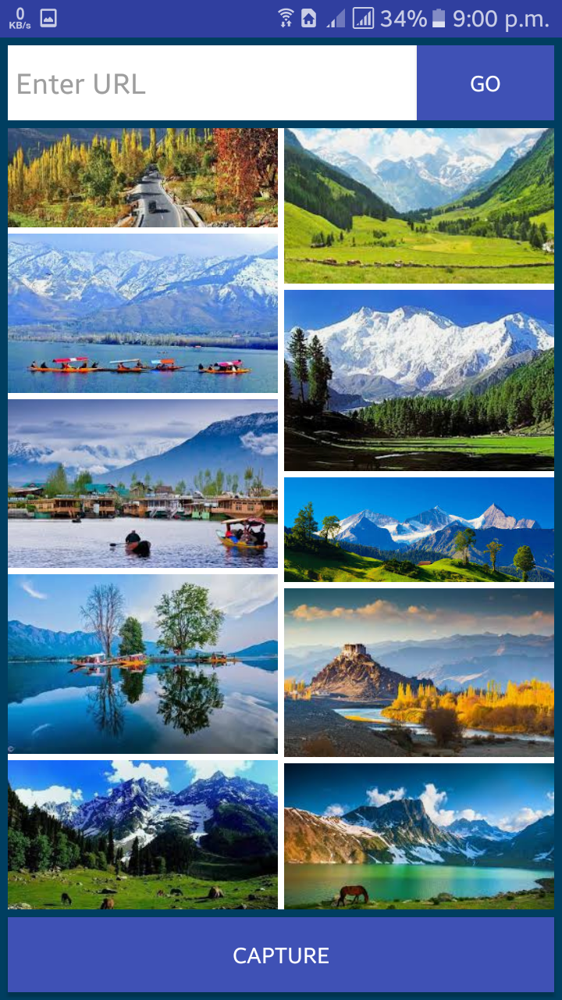
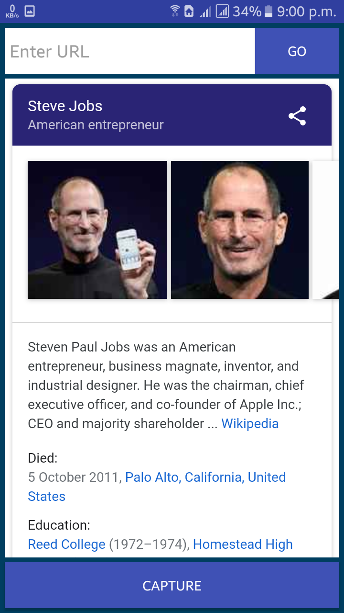
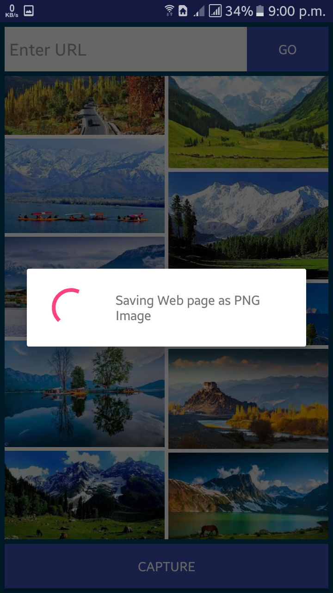

Web Capture
======

</img>

**Web Capture** allows converting any webpage into the High-quality image. It can capture entire webpage with just one click.

#### Screenshot

</img> 
</img> 
</img>
</img>

#### App Stores
<!-- edit this image location -->

#### Works on
* Android 4.0.3 (Ice Cream Sandwich) and above.

### Permissions
* INTERNET
* WRITE_EXTERNAL_STORAGE
* ACCESS_NETWORK_STATE
* ACCESS_NETWORK_STATE

### Built With

* [Android Studio](https://developer.android.com/studio/index.html) - The Official IDE for Android

### Authors

* **Shivam Agrawal** - [Rising Hope](http://risinghopeapps.weebly.com/)

### Version 
* Version 1.0.1

## License 
* see [LICENSE](/LICENSE) file

